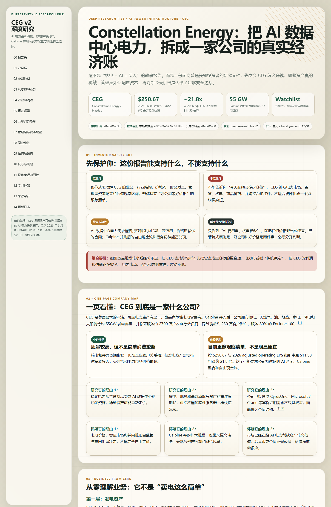

# Buffett Investing Coach


A Buffett-style investing skill pack for `Codex` and `Claude Code`.

This project is no longer just a single prompt skill. It now includes a repeatable investment research workflow inspired by long-running agent research loops: plan the work, collect source evidence, draft the memo, attack the thesis, revise, render HTML, verify the screenshot, and persist the durable lessons into a wiki.

> Educational use only. This repository does not provide personalized financial advice, trading instructions, or guaranteed investment outcomes.

## What Is Included

| Skill | Purpose |
|---|---|
| `buffett-investing-coach` | Buffett-style owner-analyst reasoning: business quality, moat, management, owner earnings, valuation, margin of safety, watchlists, and teaching-first memos |
| `investment-research-pipeline` | ARIS-style repeatable workflow: research plan, source audit, draft memo, adversarial review, final memo, HTML rendering, screenshot verification, and wiki update |

## Demo

The current golden example is a deep CEG research file on AI power infrastructure.



- v2 HTML report: `reports/company-memos/CEG_AI_Power_Buffett_Report_v2_2026-06-09.html`
- v2 screenshot: `reports/company-memos/CEG_AI_Power_Buffett_Report_v2_2026-06-09.screenshot.png`
- workflow packet: `examples/CEG/`
- wiki entry: `wiki/companies/CEG.md`

## Install In 30 Seconds

The installer now installs both skills by default:

- `buffett-investing-coach`
- `investment-research-pipeline`

### Windows PowerShell

Install into both `Codex` and `Claude Code`:

```powershell
$tmp = Join-Path $env:TEMP 'install-buffett-skills.ps1'
Invoke-WebRequest -UseBasicParsing 'https://raw.githubusercontent.com/Lengcangr/Buffett/main/install.ps1' -OutFile $tmp
powershell -ExecutionPolicy Bypass -File $tmp -Agent both -Force
Remove-Item $tmp
```

### macOS / Linux

Install into both `Codex` and `Claude Code`:

```bash
tmp="$(mktemp)"
curl -fsSL https://raw.githubusercontent.com/Lengcangr/Buffett/main/install.sh -o "$tmp"
bash "$tmp" --agent both --force
rm -f "$tmp"
```

After install, restart your agent so the skills are discovered.

## First Prompts

Run a full company research workflow:

```text
Use $investment-research-pipeline and $buffett-investing-coach in company-underwrite mode for CEG.
Create the research plan, source audit, adversarial review, final memo, HTML report, screenshot, and wiki update.
```

Run a normal Buffett-style memo:

```text
Use $buffett-investing-coach to analyze Microsoft from a Buffett-style owner-analyst lens.
```

Build a watchlist:

```text
Use $buffett-investing-coach to build a watchlist of high-quality semiconductor companies and separate business quality from current price.
```

Create a deep HTML report:

```text
Use $investment-research-pipeline and $buffett-investing-coach to write a teaching-first memo on Constellation Energy and export an HTML report with screenshot verification.
```

## Research Workflow

The full workflow is intentionally strict:

```text
1. research_plan.md
2. source_audit.md
3. memo_draft.md
4. adversarial_review.md
5. memo_final.md
6. final_report.html
7. final_report.screenshot.png
8. wiki_update.md
```

The workflow is designed to prevent common investing-agent failures:

- jumping to a buy/sell answer before explaining the business;
- treating a good company as a good investment at any price;
- treating a price decline as a margin of safety;
- over-trusting management slides;
- letting AI/theme narratives overpower cash-flow evidence;
- hiding unresolved questions;
- shipping HTML reports without render and encoding checks.

## Repository Layout

```text
skills/
  buffett-investing-coach/
    SKILL.md
    agents/
    references/
    scripts/
  investment-research-pipeline/
    SKILL.md
workflows/
  company-underwrite/
    README.md
    templates/
examples/
  CEG/
    research_plan.md
    source_audit.md
    adversarial_review.md
    wiki_update.md
wiki/
  companies/
  industries/
  principles/
  watchlists/
reports/
  company-memos/
install.ps1
install.sh
```

## Why This Skill Pack Feels Different

Most investing assistants collapse everything into a binary action answer. This project is opinionated in a different direction:

- it separates business quality from current price;
- it keeps great-but-expensive companies on a watchlist instead of discarding them;
- it requires source audits for material claims;
- it adds adversarial review before final conclusions;
- it teaches the user the reasoning, not only the conclusion;
- it treats report rendering quality as part of correctness;
- it persists durable lessons into a wiki so future research compounds.

## Agent Compatibility

| Agent | Status | Install target | Notes |
|---|---|---|---|
| `Codex` | First-class | `~/.codex/skills/<skill-name>` | Uses portable `SKILL.md` folders |
| `Claude Code` | First-class | `~/.claude/skills/<skill-name>` | Uses the same canonical skill folders |
| Other code agents | Manual reuse | N/A | Prompts, references, templates, and scripts may still be reused manually |

## Advanced Install Options

<details>
<summary>Install only Codex</summary>

Windows PowerShell:

```powershell
$tmp = Join-Path $env:TEMP 'install-buffett-skills.ps1'
Invoke-WebRequest -UseBasicParsing 'https://raw.githubusercontent.com/Lengcangr/Buffett/main/install.ps1' -OutFile $tmp
powershell -ExecutionPolicy Bypass -File $tmp -Agent codex -Force
Remove-Item $tmp
```

macOS / Linux:

```bash
tmp="$(mktemp)"
curl -fsSL https://raw.githubusercontent.com/Lengcangr/Buffett/main/install.sh -o "$tmp"
bash "$tmp" --agent codex --force
rm -f "$tmp"
```

</details>

<details>
<summary>Install only Claude Code</summary>

Windows PowerShell:

```powershell
$tmp = Join-Path $env:TEMP 'install-buffett-skills.ps1'
Invoke-WebRequest -UseBasicParsing 'https://raw.githubusercontent.com/Lengcangr/Buffett/main/install.ps1' -OutFile $tmp
powershell -ExecutionPolicy Bypass -File $tmp -Agent claude -Force
Remove-Item $tmp
```

macOS / Linux:

```bash
tmp="$(mktemp)"
curl -fsSL https://raw.githubusercontent.com/Lengcangr/Buffett/main/install.sh -o "$tmp"
bash "$tmp" --agent claude --force
rm -f "$tmp"
```

</details>

<details>
<summary>Install one skill only</summary>

Windows PowerShell:

```powershell
.\install.ps1 -Agent both -SkillName buffett-investing-coach -Force
```

macOS / Linux:

```bash
./install.sh --agent both --skill-name buffett-investing-coach --force
```

</details>

<details>
<summary>Install from a local clone</summary>

Windows PowerShell:

```powershell
.\install.ps1 -Agent both -Force
```

macOS / Linux:

```bash
./install.sh --agent both --force
```

</details>

## Safety And Scope

- This is an educational analysis skill pack, not a portfolio-management service.
- It does not tell users to go all-in, use leverage, trade options, or treat one model output as certainty.
- It prefers primary sources, explicit missing-evidence notes, and `too hard` when the facts do not support conviction.
- It separates operating-company analysis from ETFs, derivatives, crypto tokens, and other wrappers.
- HTML outputs must pass a render-verification gate: UTF-8 file, browser render, screenshot artifact, and no garbled non-English text.

## What Is Not Included

This public package intentionally excludes large or potentially copyrighted bulk materials such as:

- ebooks;
- downloaded videos or audio;
- raw paid transcripts;
- scraped caches;
- bulk market datasets;
- third-party media files without redistribution rights.

## License

MIT License. The license applies to the original skill code, prompts, references, scripts, templates, reports, and repository documentation in this project. It does not grant rights to third-party books, shareholder letters, filings, audio, video, or datasets referenced by the skill.
